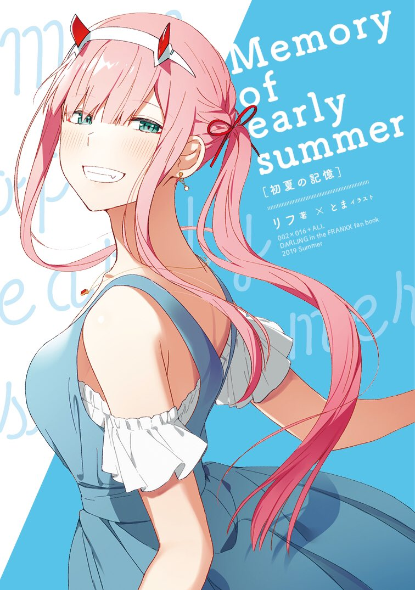
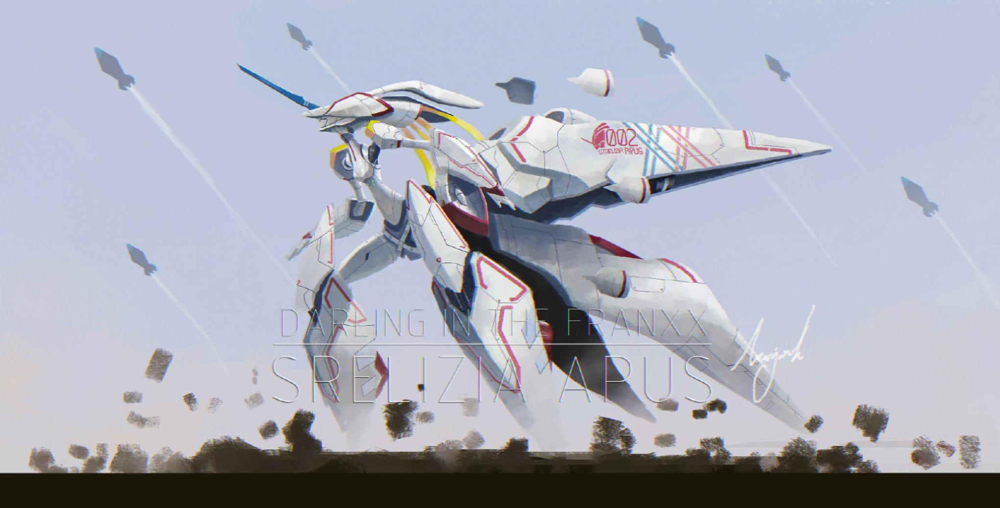
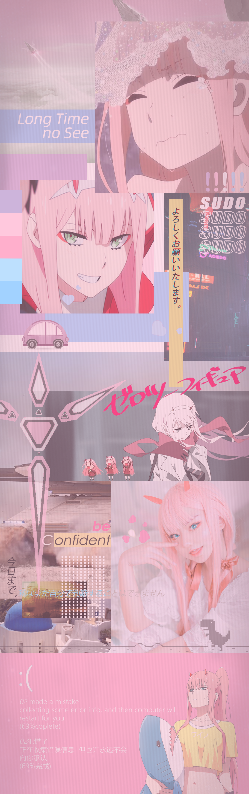
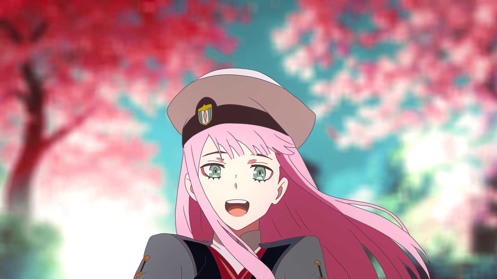
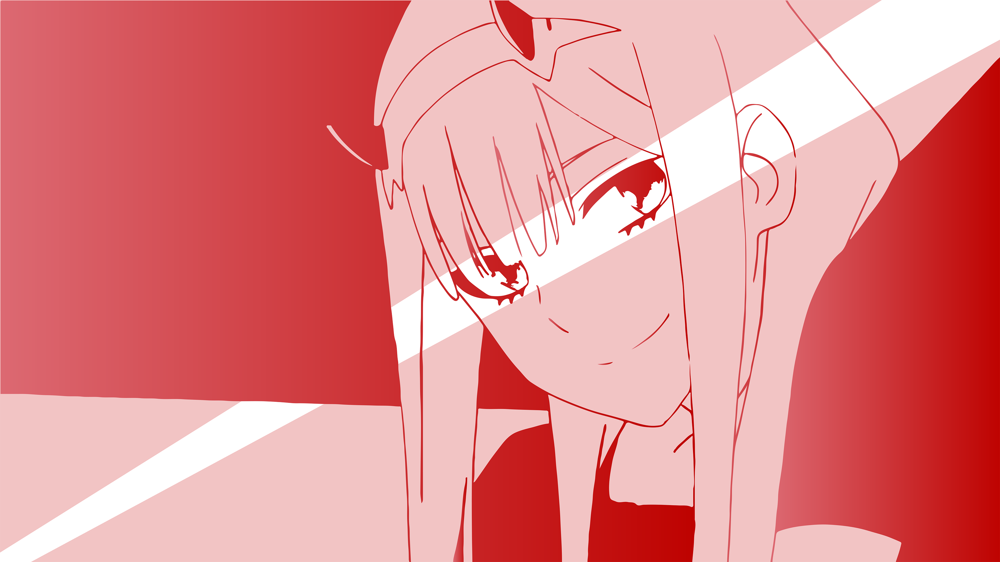
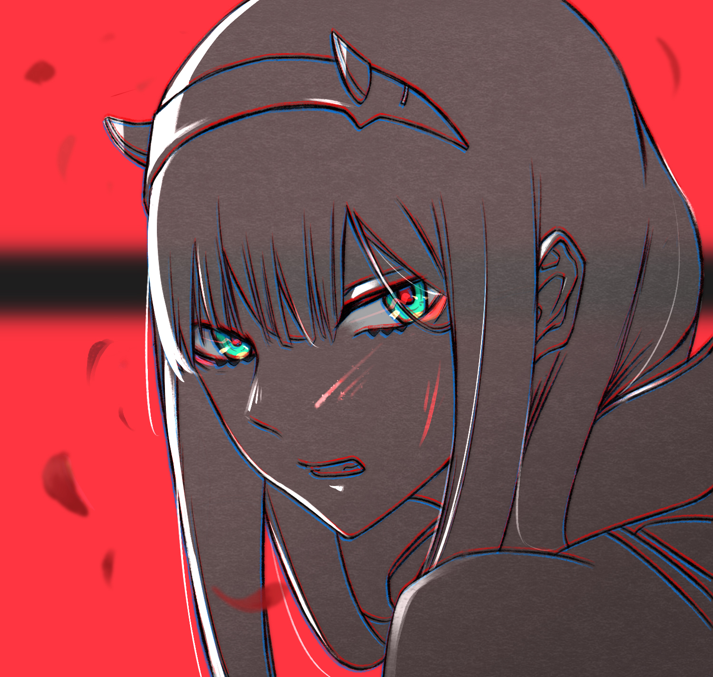
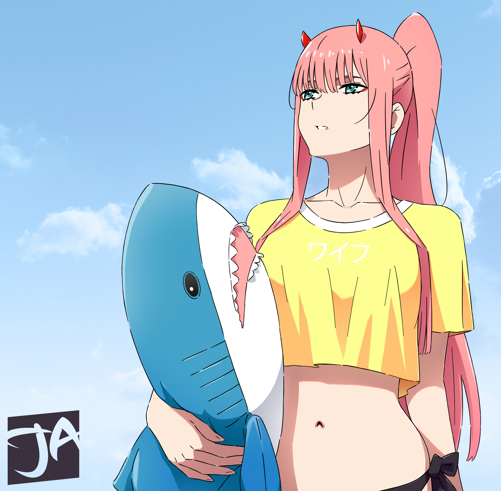
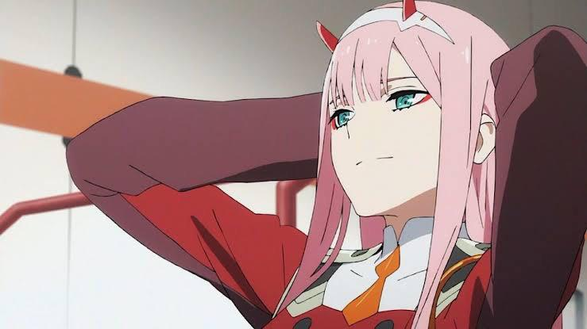

[//]: # ()

### 你好、Hello、こにちは 👋
`cfdxkk` 是 `冲锋的小卡卡` 的缩写，至于我为啥叫 `冲锋的小卡卡` ，我自己也记不清了   
我在其他平台也可能会使用像 `02`、`ZERO TWO` 这样的ID。   
`cfdxkk` is the abbreviation of `冲锋的小卡卡`    
You can also see me use the ID like `02` or `ZERO TWO` in other website.

- 🌸 喜欢可爱的东西
- 📚 我喜欢每天能学到新知识
- ⭐ calibur.tv 管理员
- 🏢 IBMer
- 🎶 喜欢听EDM，最近喜欢 future base、dubstep 和 Synthwave
- 🎮 喜欢玩各种3A，星际公民玩家 (董事长俱乐部成员)，战雷美系毕业

这个文档的 Layout 本来是想抄 @艾了个拉 的自述文件，  
但是，当 README.md 抄到这里的时候，我人愣住了，   
我发现自己根本没什么特长、没有能拿得出手的成果，也一点也不可爱；一时间竟然不知如何下手。  
于是我索性换个思路，我开始回忆我的人生，并把它们写了下来，欢迎你展开下面的折叠阅读。

  
童年

  我从小就不爱上学 (虽然现在也是)，初三下学期开始我就在家待着了，  
  当时在家里沉迷于听 (懒人听书APP) 玄幻小说；  
  父母心想反正我在家待着，不如去大城市看看胃病 (虽然直到现在也胃也没治好)  
  于是我离开了我生活了十几年的瓦房店，举家迁往大连。   
  至于我休学的原因，大概是害怕老师体罚、害怕同学欺负以及真的不喜欢学数学语文英语。  

  不过，最后我还是回瓦房店参加了中考。  
  而作为我参加中考的 "代价"，就是我要求我爸给我买一台PS4 (现在想想我真tm是个带孝子)  

  当然中考的结果肯定是非常差的，但那个暑假，我通关了 GTA5  
  中考成绩下来之后，我顺理成章地没有考上任何高中。  

  我的成绩只允许我去 **大连念中专** 或者回 **瓦房店念美术高中**；父母问我的选择，但我当时没有任何想法，我只想打游戏做主播，  
  于是他们俩连拖带骂地带我实地考察了 **大连电子学校** 和 **大连轻工业学校**  
  最后，我被招生办老师连忽悠带骗，选择了 **大连电子学校** 的 **网络工程 2+3** 专业

  这所谓的 **网络工程 2+3**  
  其实就是 前2年 在 **大连电子学校** 读中专，后3年 在 **辽宁机电职业技术学院** 读大专。  
  在大连电子学校这两年我过的非常快乐；  
  同学大多很"社会"，也很喜欢打游戏(全班70%同学上过王者)，学校里没有校园霸凌，80%的课都非常简单，也是我喜欢的专业 (虽然以我现在的眼光来开，老师大多数都挺菜的)
  那真是一段美妙的时光，没有压力，上学摸鱼，放学打游戏；  
  虽然最后和音乐鉴赏老师闹了点不愉快，总体而言是这应该是我人生中最幸福的一段时光了。

  说到音乐鉴赏老师，虽然我和她闹了点不愉快，但我真的应该感谢她，  
  实际上她是我 **UP主** 生涯的启蒙老师；  
  她曾经布置过一个作业：让学生使用自己喜欢的音乐给一段没有音轨的，手指舞的视频配乐  (这不就是做MAD/AMV么)   
  也是这次作业，让我迷上了剪视频。
  
  在 **大连电子学校** 这段时间里，我遇到了 @睡到自然醒  
  他是全班唯一一个和我一样走读上学放学的，我会和他做同一班公交车。

  
在人间

  两年的时间很快就过去了，  
  我不得不和 @睡到自然醒 以及班级里大部分同学前往 **辽宁机电职业技术学院** (以下简称 机电) 继续"深造"  
  而在 **大连电子学校** 的最后一个暑假，  
  我看了我人生中第一部日本动画： 《某科学的超电磁炮》  
  这就是万恶之源。
  
  在机电，我接触到了很多新同学，我和 @睡到自然醒 也没法继续走读，只能住校了  
  我和他开始看更多的动画，也接触了更多喜欢看动画的同学(舍友)  
  当然我那个时候都在瞎看，大概的顺序是：  
  * 刀剑神域
  * 埃罗芒阿老师
  * 龙与虎
  * Fate/Zero
  * ...

  时间到了 **2018年，春**  
  这是非常重要的一年，应该是我在机电的一年级下学期，

  @睡到自然醒 在追一部新番，叫 《紫罗兰永恒花园》  
  我&nbsp; &nbsp; &nbsp; &nbsp; &nbsp; &nbsp; &nbsp; &nbsp;也在追一部新番，叫 《DARLING in the FRANXX》

  当我在 darlinginthefranxx吧 (百度贴吧) 找这动画的资源时，我看到了 @冰淤 发布的 calibur.tv 的宣传帖子  
  当我访问 calibur.tv 时，我被它精美简洁的设计迷到了。  
  我在网站里看到了 calibur 群聊的群号，我啥也没想我就搜索加入了  
  我当时的想法就是：`我草这站长太牛逼了这网站设计的真好我tm一定要拜师学艺我终于有咸鱼翻身的机会了二次元理想国就有我来创建吧哈哈哈`    
  
  于是我自愿加入了 @冰淤 的团队，开始为二次元，为了我理想的事业 "用爱发电"  
  
  后来的事情大家应该也知道了；calibur.tv 因为能说的和不能说的种种原因，关门大吉，  
  团队里的成员也都"燃尽了"，项目进入了停摆的状态。

  在维护 calibur 这期间，是我人生中学习、成长最快的时间；  
  我学习了如何管理项目，如何为人处事，也学习了最基本的商业和的网站架构知识。  

  calibur.tv 倒闭之后，  
  我意识到，没有 calibur ，我的人生只剩下浑浑噩噩，浪费时间  
  所以，我和 @睡到自然醒 ，以及其他几个同学，选择了 `专升本`
  
  能让我重新鼓起勇气，拿起数学和英语书去学习，就已经是很大的成功了，不要指望我能学的多好   
  我从 `每天打游戏/做MAD` 转变成了 `每天带着愧疚打游戏/做MAD` 

  `专升本` 的难度，对我来说其实挺高的，毕竟我的数学只有初中水平...  
  不过非常幸运也非常不幸的是，我赶上了疫情 (扩招、考试延期)  
  尽管扩招了，但我报志愿时也选择了比较保守的学校，  
  最终，我以本来能上 **东北财经大学** (一本) 的分数，上了 **大连东软信息学院** (二本私立)   

  专升本考试结束，我也不得不和 @睡到自然醒 各奔东西  
  (ps: 他也顺利升学了哦~)

  
我的大学

  虽然东财变东软 (摩托变单车)，但至少这是个大学，  
  就算再烂，咱该上还是得上啊  

  `专升本`的大学只有两年，而这两年中最后一年还是实习，  
  所以实际上我只在东软上了一年学
  
  在东软这一年，说实话我学的并不多，  
  在我脑海中，比较好玩的大概只有和舍友 @goka 参加了学校的网安社这一件事，  

  @goka 大专时也是网络专业，所以我和他多少还是有点臭味相投，  
  (顺带一提，我在东软的寝室里四个人都是二次元，四个人也不抽烟不喝酒，没有小心眼，都喜欢打游戏；其乐融融，梦中情寝)  
  他喜欢研究各种网络设备和技术，我也有点兴趣  
  在认识他之前，我只知道用 VPN 或者 SS/SSR 来科学上网，认识他之后那真是大开眼界。  

  说回网安社，这是我和他第一次接触 ctf   
  刚开始我和他刷题刷疯了，后来题越来越难，我俩越来越懒，遂放弃，  
  再后来我们俩就被网安社开除了。  
  虽然被开除了，但学了很多好玩的东西，算是增长了人生阅历了。

  再之后我们寝室全部参加了 IBM 和 东软 合作的定制班，开始学习日语和编程  
  正常来说，东软日语课一个学期要 4000+RMB，但参加 IBM 定制班可以白嫖，所以我们四个上日语课特别认真，上编程课要么摸鱼要么逃课。

  最后，我成功被 IBM 录用了... 他们仨大概是因为没我卷就没录上。

  
再在人间

  我是 2021 年 6 月左右被IBM录用的，而正式的报道时间是 7 月中旬，  
  所以我有了一个月的时间差，  

  这一个月里，我心想着我马上要上岗了，总不能只会写点 html/css 吧，  
  于是我开始学 Vue  
  
  7 月，正式上岗  
  第一个任务是做公司内部管理系统，  
  说是内部管理系统，实际上就是每年给实习生练手的，技术栈是 Struts2  
  因为每一年实习生都会用这个项目练手，所以代码多少沾点屎山，  
  我也从来没听过，没学过 Struts2   
  刚开始是吃了不少苦，好在后面慢慢上手了，  
  最关键的是，我居然神奇地发现我是所有实习生里技术最好的一个...

  得益于此，我有机会加入公司里一个研(开)发新产品的组 (IBM里很多组都是维护、测试或者咨询业务，搞新技术开发的很少)，  
  于是我终于有机会做真正的开发了，

  这个组是真不一般，虽然技术肯定没大厂那么牛逼，但至少混合云，k8s啥的都用上了；    
  开发的技术栈是 `React` + `Spring` + `Node`
  在这个组里我是真的学了不少东西，头发也相应地掉了不少

### 最后，让我们在星海中再相遇

---

#### 社交媒体

#### 技术栈

etc.......

#### 我的梦想

1. Make Calibur Great Again
2. DARLING in the FRANXX 第二季
3. 成为"聚光灯下的人"

---

  

     谢谢你看到这儿^_^ 您可以点击这里查看更多02的插画
  

<!--
**cfdxkk/cfdxkk** is a ✨ _special_ ✨ repository because its `README.md` (this file) appears on your GitHub profile.

Here are some ideas to get you started:

- 🔭 I’m currently working on ...
- 🌱 I’m currently learning ...
- 👯 I’m looking to collaborate on ...
- 🤔 I’m looking for help with ...
- 💬 Ask me about ...
- 📫 How to reach me: ...
- 😄 Pronouns: ...
- ⚡ Fun fact: ...
-->
